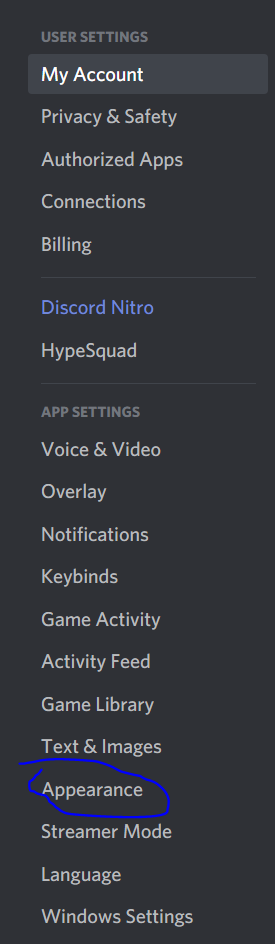
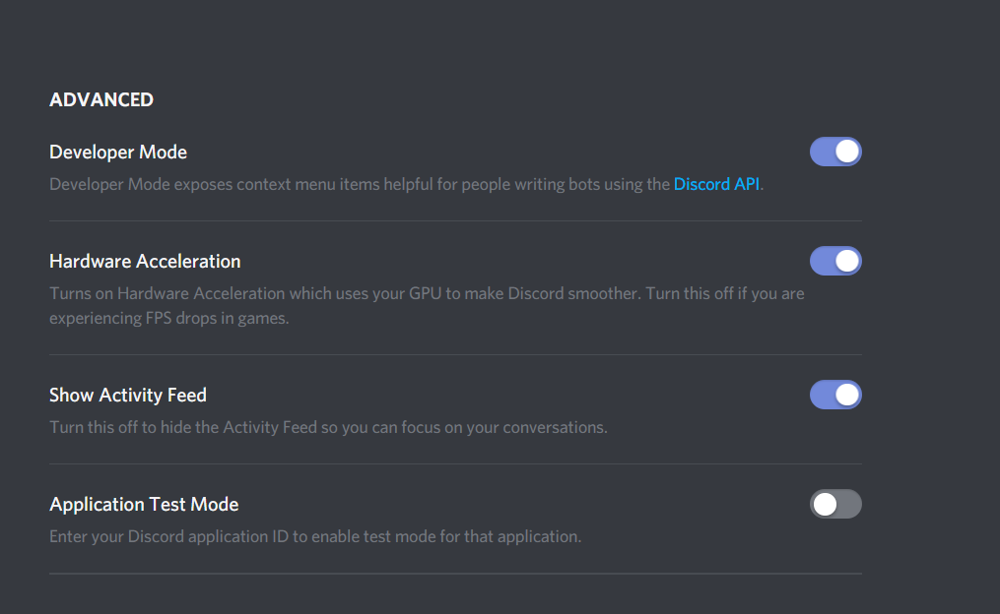

************************************
Setting Up Listeners
************************************

There are two commands in DeviantCord that adds listeners that check gallery folders for new deviations.
However this page aims to clear misconceptions with configuring listeners.
The addartist command is the first command that should be ran for a new artist,

Things to Note:
*********************
* The bot needs Exact Foldernames (Case Sensitive)
* The bot needs the artists name exactly (Not Case Sensitive)
* Artist Username should be in quotes
* Folder name should be in quotes
* The addartist command is used to add a new artist that has no other listeners
* The addfolder command adds another listener for an already existing artist's folder.

Correct Arguments
-----------------

For Example with the addartist and addfolder command it is :

$addartist *<artist_username>* *<folder>* *<channel_id>* *<inverted>*

$addfolder *<artist_username>* *<folder>* *<channel_id>* *<inverted>*

If we looked at an artists page, such as the one below

.. image:: ../_static/SettingUp.png
*Example image from Zander-The-Artist (With Permission) see his work* `here <https://www.deviantart.com/zander-the-artist>`_

Looking above at the example image, and using it as an example you should note the following

The addartist command should have the artist name and in this case it would be "zander-the-artist" not "zander the artist"

The artist username field should be the same as the yellow highlighted area in the picture above.

The folder field for the Hope in Friends Comic folder should be the exactly what it is in the sidebar on the left.
In this case the folder for the comic Hope In Friends should be "Hope In Friends Comic" not "Hope in Friends"

$addartist "zander-the-artist" "Hope In Friends Comic" *<channel_id>* false

*Inverted in this case would be false, but it depends on what artist and what folder*

Inverted Galleries
------------------
Inverted galleries is the term we use to indicate that newest deviations are at the top instead of the bottom.
An example of an inverted gallery can be seen `here <https://www.deviantart.com/pkm-150/gallery/58231950/Eeveelution-Squad>`_

The inverted argument would be declared true or false in the addfolder command and addartist command.

Discord Developer Mode
**********************
Discord Developer Mode is required in order to get text channel id's,
you will need to enable it by clicking the gear icon near your name

..  image:: discordprofile.png

Once you get into that menu click the Appearance Tab

then scroll down to the bottom and enable Developer Mode.

Credits
*******
Special Thanks to Tony/Zander-The-Artist for allowing DeviantCord to feature his gallery as an example
You can see his outstanding comic Hope in Friends `over here <https://www.deviantart.com/zander-the-artist>`_
