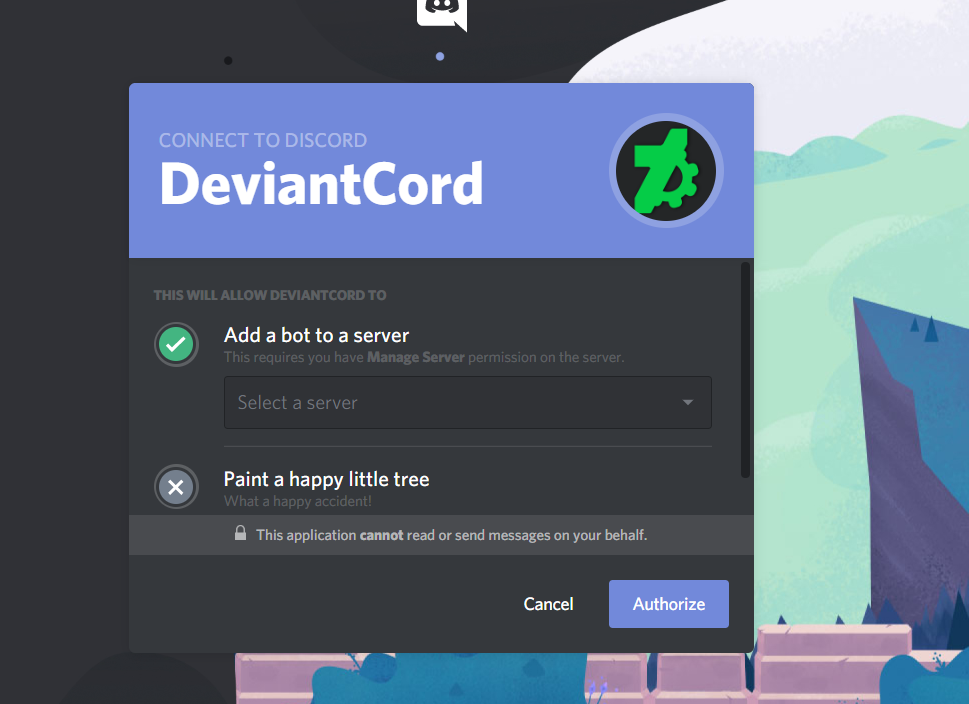

************************************
Getting the bot to join your server
************************************
Getting the bot to join your server is easy. All you need is:

- Manage Server Permission on the server in question.
- Administrator on the server to set the minimum rank for users of the bot.

Once you confirm you have the necessary permissions,  use the link
`link here <https://discordapp.com/api/oauth2/authorize?client_id=576293421078282240&permissions=0&scope=bot>`_.
to make the bot join the server.

It should look similiar to the screenshot below

.. note:: If you do not have the requirements above on the server. The server will not show on this list.

Select the server you want to join the server to join.

Once the bot is in the server proceed to :doc:`permissions`

Getting Support
========================
Support will be given only through the official DeviantCord Discord server.
Our support team at this time is very small and we plan on expanding it, but we keep support to Discord
to allow for others to help out and also allow for others who may be experiencing problems to see solutions staff may
have already answered.

You can join the server
`here <https://discord.gg/ubmkcsk>`_.

FAQ
============================

**How are version upgrades handled?**

Bug Fixes will be applied to all server being hosted by us upon the updates being posted to Github*
Updates always go through a testing process to make sure everything is functioning properly before a release.*
When a new update is finished and released an announcement will be posted in the maintenance text chat

**Who will have access to my bots files?**

Only Errite Employee's and certain staff members will be given access outside of server owners in order to fix issues
and maintain the bot. Those who are given access are required to have a large amount of experience with Errite or with
the team for them to have access to the files.
(The organization who maintains the bot).

**Are there any backups for our bots data?**

All data is backed up daily on another server. Backups are retained for one month before being deleted.

**What is Errite?**

Errite is an organization based out of Chicago that primarily specializes in Art, Game Development, and software
development. Most of the individuals behind the creation of the bot are in this organization.

**Is there any difference between the self-hosting and the hosting you provide?**

No, there is no major difference at this time in terms of functionality. The files provided on Github are the same ones
used on the hosting we provide. The only difference is that we handle the management of the bot from the hosting side of
things such as handling maintenance, and upgrading the bot.
