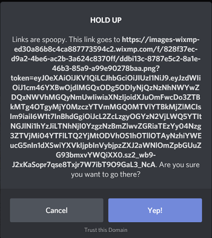

************************
DeviantCord Security FAQ
************************
Last Updated July 19th, 2019

.. warning::
    Make sure that you are looking at the latest version of the documentation.
    Otherwise this information may have changed.

Server Security
===============

**What measures are put in place to protect the servers housing DeviantCord?**

DeviantCord has many measures such as:

- Brute Force Detection
- 2FA on all accounts in regards to Hosting Provider Accounts
- 2FA on all Discord Accounts linked to the bot.
- 2FA Key Encryption to login
- DDoS Protection on all servers

**Does DeviantCord have DDoS Protection**

Yes we have DDoS Protection for all of our production servers. When a DDoS Attack occurs, measures will automatically
activate without interrupting legitmate usage.

**There are rumors about X person DDoSing DeviantCord.**

No need to worry, as said in the previous question we have very reliable DDoS Protection that will activate automatically
on all of our servers.

**How are security vulnerabilities taken care of for servers housing DeviantCord?**

We check many CVE websites for our servers daily to make sure that there is nothing that needs patching, not to
mention we check updates on our servers daily and will apply them depending on what the updates do.

For security related updates, we will do what is necessary to apply security updates.

In regards to API Vulnerabilities for any libraries that DeviantCord uses, we keep a sharp eye on announcements
by the developers of libraries we use. In this case urllib3 and DiscordPy

**How are version upgrades handled for the public bot?**

In most cases bug Fixes will be applied to all server being hosted by us upon the updates being posted to Github*
Updates always go through a testing process to make sure everything is functioning properly before a release.*
When a new update is finished and released an announcement will be posted in the maintenance text chat.
However if there is an update that we feel may cause issues in Discord Servers we will wait a couple days to get in
touch with server owners before applying it to the public bot.

**Who has access to the bots token?**

Only Michael (The Creator/Lead Dev) has access to the bots token.

**Are there any backups for our bots data?**

All data is backed up daily on another server. Backups are retained for one month before being deleted.

**Who will have access to the public bots files?**

Only Errite Employee's and certain staff members will be given access outside of server owners in order to fix issues
and maintain the bot. Those who are given access are required to have a large amount of experience with Errite or with
the team for them to have access to the files. Not to mention they are all under legal agreements that we will not be
detailing for obvious reasons.

**What is Errite?**

Errite is an organization based out of Chicago that primarily specializes in Art, Game Development, and software
development. Most of the individuals behind the creation of the bot are in this organization.

**Is there any difference between the self-hosting and the hosting you provide?**

No, there is no major difference at this time in terms of functionality. The only difference is that DeviantCord can
make the bot leave the server on the hosting we provide without the server owner doing anything.The files provided on Github are the same ones
used on the hosting we provide. The only difference is that we handle the management of the bot from the hosting side of
things such as handling maintenance, and upgrading the bot.

You can see information regarding erriteCommmands here :doc:`additionalinfo`

General Security
================
**Is DeviantCord Secure?**

DeviantCord is secure, it runs when a command is ran to make sure that the user that used the command is authorized to
use the command is executing the command from the target server and not another server. However it doesn't hurt to limit
DeviantCord to be able to see messages/send messages in channels meant for the bot.

**When I click view image source link from an image posted by DeviantCord I get a spooky link notice for wixmp.com**

Wix owns DeviantArt and stores deviation images on its Cloud Service. This is why the link is wixmp.com and not
DeviantArt. You can see this by right clicking the image url on the deviantart page and finding that it goes to wixmp.

**I found a vulnerability in DeviantCord where do I report it?**

DO NOT create a Github Issue. Join our Discord server and contact a Developer via DM's (Even if they are offline).
Only discuss this through DM's, as disclosing a vulnerability on the Discord Server publically is against our servers rules.
This will ensure that a reliable method of communication and make it easier to find the bug and patch it

You can join our discord server `here <https://discord.gg/ubmkcsk>`_.

**I Found a bug that doesn't involve security? Where should I report it?**

You can report it on our GitHub page here `here <https://github.com/ErriteEpticRikez/DeviantCord>`_. or report it on
our Discord server `here <https://discord.gg/ubmkcsk>`_.

**Can the DeviantCord Bot make modifications to my Discord Account?**

No, bot users cannot make changes to your account for the public bot and self hosted DeviantCord bots.

**My Antivirus/Browser says that DeviantCord is dangerous!**

If your virus scanner reports a copy of DeviantCord downloaded from our gitlab here `here <https://github.com/ErriteEpticRikez/DeviantCord>`_.
is infected with a virus, it is a false positive. We scan every release of DeviantCord using the scanning service at
www.virustotal.com.  It scans with 70 anti-virus products to make sure DeviantCord is safe before we make it available
for download.

Please report antivirus issues to us via our Discord server `here <https://discord.gg/ubmkcsk>`_.

Additionally you can see the list of known false positives here :doc:`false-positives`

Phishing
==================
**I received an email/form of communication from someone claiming to be from DeviantCord**

We do not reach out to server owners outside of Discord. All of our communication to our users is through Discord.
If you receive an email claiming to be from DeviantCord or Errite. Contact us on our Discord server
`here <https://discord.gg/ubmkcsk>`_.

**How Can I determine if someone is DeviantCord staff?**

Check the DeviantCord Discord server and check the #roles channel for the context of each role
if they do not have a staff rank then they are not DeviantCord staff.

However if the behavior of the staff member is weird, bring it up to a Moderator/Developer

**I found someone impersonating DeviantCord Staff! What do I do?**

Join our Discord server and notify a staff member, and supply us their Discord ID (Enable Developer Mode and right click
the user and select copy ID.

You can see how to enable developer mode here :doc:'addinglisteners'

**Help!!! there was an event in the community in regards to security and I want to know if DeviantCord is affected**

If none of the questions here answer the question, join our Discord

It more then likely will not affect DeviantCord. However you can view issues that we are currently aware about here.

**What Discord ID's does the public bot use?**

.. warning::
    Make sure that you are looking at the latest version of the documentation.
    Otherwise there may be DiscordID's missing.

- DeviantCord#4637
- DeviantCord#1257
- TestDeviantCord#0062

**I found one of the bots on my server not on this list.**

First make sure that this is the latest version of the documentation. If this is the latest version of the documentation.
Contact DeviantCord Support
